# Google Cloud Platform (GCP) VM Setup
## EECS E6792 2026 Spring

In this lab we will be training a [YOLOv4-Tiny](https://medium.com/analytics-vidhya/yolov4-vs-yolov4-tiny-97932b6ec8ec) model using the Darknet framework. The YOLOv4-Tiny model requires significantly more resources to train than the classification and regression models you have been working with in previous labs. To train in a reasonable amount of time, we will need to use a more powerful GPU than the TegraX1 on the Jetson Nano.

This notebook will guide you through the setup of a Google Cloud Platform (GCP) virtual machine. GCP offers computing stacks that can be configured both in hardware and software. You will use it to set up a VM instance with a high computing capacity GPU to train YOLOv4-Tiny quickly on a large traffic image dataset.

# NOTE: Make sure to shut down your GCP instances when you're not actively using them. Your credits will drain quickly.

## **[IMPORTANT NEW FOR 2026]**
**[PLEASE READ CAREFULLY BEFORE YOU START]**: Columbia has disabled the use of External IPs in GCP within the Columbia Organization. Therefore, if you are using GCP with your Columbia account (LionMail login), you can no longer connect to your Jupyter Notebook / Lab by pasting your external ID together with your chosen port into the browswer. Instead, we provide you with two options to use GCP:
  1. Use Your Personal Email and follow the instructions below. This is much simpler and enables you to use the External ID as usual.
  2. If you accidentally claim the coupon using your LionMail account, use Google Cloud SDK (gcloud) with port forwarding.

### [Important] Read the following notes below before setup:
#### [Note 1]
Start this process early! GCP resources are based on availability and are not guaranteed to be allocated to a user. You might have to keep retrying to get a machine with the desired GPU.
#### [Note 2]
**Make sure that you are claiming the coupon using your PERSONAL Email account (Top Right side of the screen with your initial) (more information on how to redeem the coupon is found in step 3 below). Columbia has recently changed their GCP policies, and has restricted the use of External IPs and internet if using their organization. We have provided backup instructions if you accidentally use your Columbia Email.**
#### [Note 3]
**Again, always double check that you are using the correct account when working with GCP (Top Right side of the screen with your initial).**
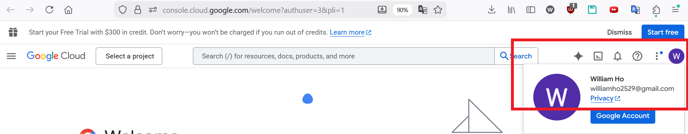 
#### [Note 4]
**VERY IMPORTANT** - Switch off any machines that are not in use! **You will be charged every hour that the instance is active.** The rate depends on the machine configuration chosen. **You will also be charged
for any disks that are created at the end of the month** (usually the charge for disks is much less than running an instance, but if you run out of credits and have active disks, you will still get charged to your card).

Any issues with billing/accidental charges need to be handled with Google Cloud support directly.

## Steps
1. Go to the [Google cloud console](https://cloud.google.com/) and sign in with your Personal account (**DO NOT USE** yourUNI@columbia.edu).
**Your google coupon is associated with a single account, so make sure that you always sign into the same account.**

2. If you are a new user of Google cloud, you can get $300 credits for free by clicking 'Get started for free'. If you already have used GCP, you can skip this step.
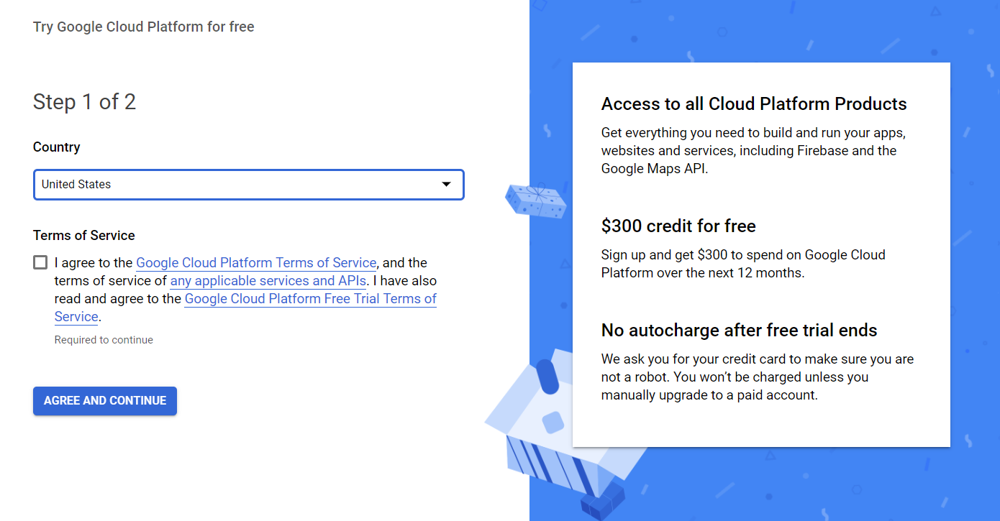
You can explore the GCP for a while with free credits. After the add/drop period, students will get educational coupons from instructors to cover course-related google cloud expenses.

3. Redeem your educational Google Cloud coupons (Google Cloud coupons will be distributed through Email after the add/drop period). Charges for using a GPU can be approximately $1/hour - so please manage your computational resources wisely.
You can claim your GCP coupons using the following link: following link: https://console.cloud.google.com/education. Fill in your name and your Personal Account (**DO NOT USE** yourUNI@columbia.edu).

4. Go to the dropdown at the top to create a new project:
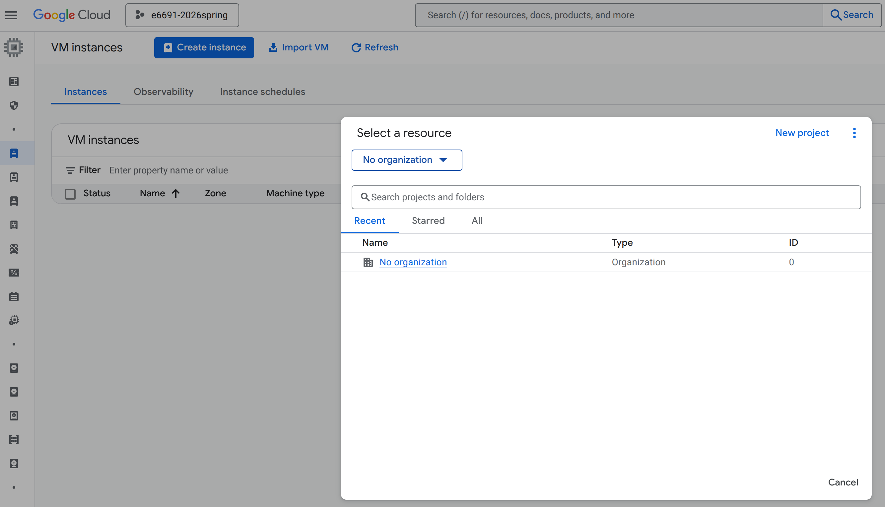

5. Fill in the details to create your project. **Set the billing account to 'Billing account for Education' to use your credits for this project. *Then Select "No organization".***
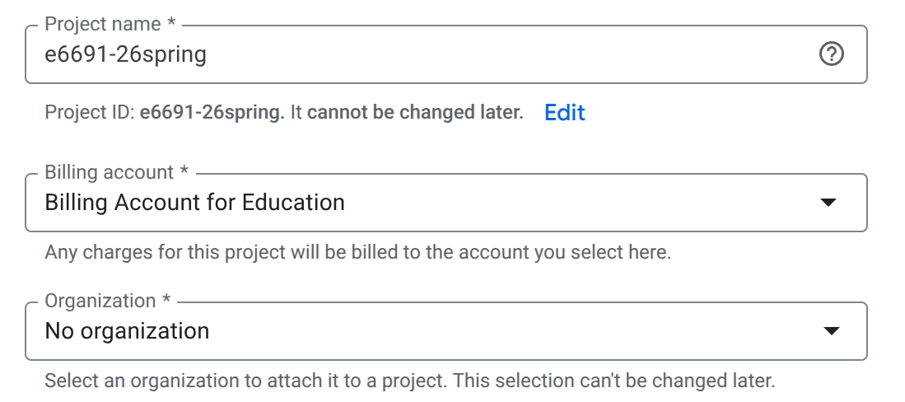
***Please make sure that the billing account and organization info are properly selected.***

6. Go to "Compute Engine" -> "VM instances" and enable the API.
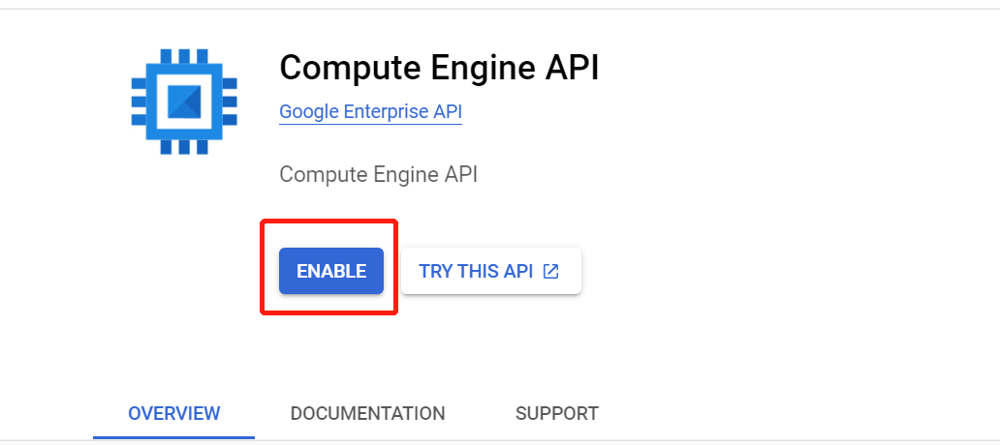

7. **Manage Quotas**:
   - Go to the "IAM & Admin" -> "Quotas & System Limits"

   - Filter for "gpus_all_regions". Check if the quota is at least 1
   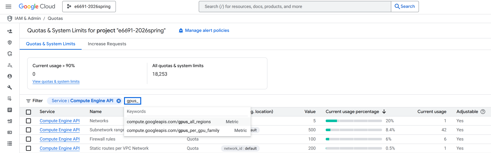

   - If the quota value is 0, edit the quota by clicking the dots on the side.
   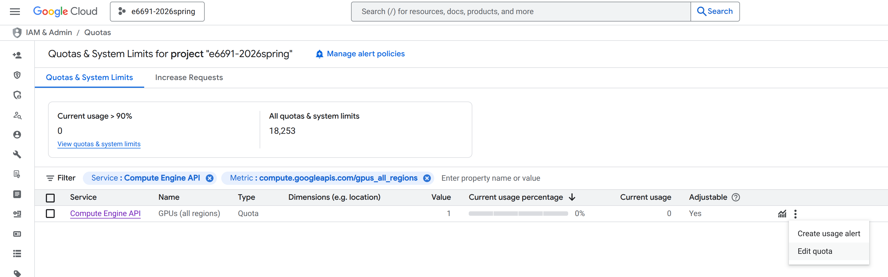

   - Set the limit to 1 (You can request an increase later if you need more GPUs, but we recommend starting with 1).
   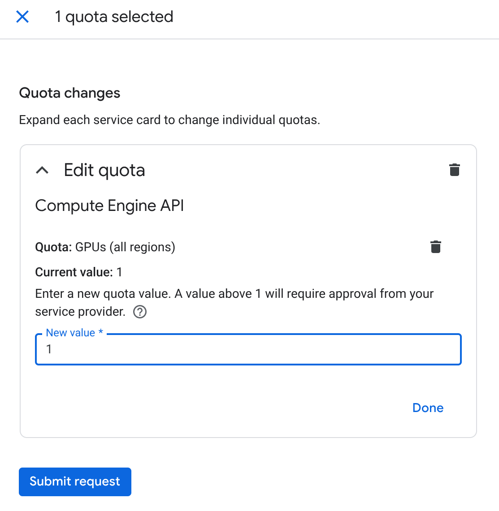

   - Wait for a moment to let Google process your request.
    You should receive an e-mail from Google informing you that they received the request. You will receive another e-mail after your quota request is approved.
    Note that the quota editing request waiting period might vary from minutes to a few hours to 4 days or even longer, depending on the general quota demand. Typically, it takes longer for Google to process the requests at the end of the semester. Please be aware of that fact and manage your time for project experiments at the end of semester properly.

8. Create a GCP VM Instance
  - Go to "Compute Engine" -> "VM instances" and click "Create Instance" at the top.
  - You will need to select a machine configuration. The recommended configuration is provided in the screenshot below. The prices may be different at different regions.
  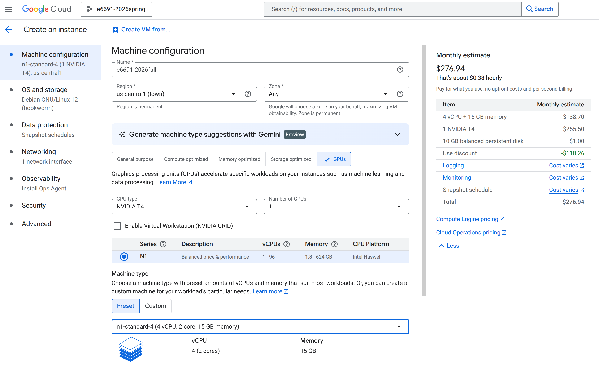
  Note that a T4 gpu is not a particularly powerful GPU, so dealing with large models/datasets might require better GPUs. **Better GPUs are typically much harder to get and far more expensive**, so plan accordingly.

  - Scroll down to the bottom to select a provision model. It is recommended to use **"Standard"**, which gives you exclusive access to your VM.

  - On the left, go to the "OS and storage" section, click "Change", and set the boot image as shown below:
  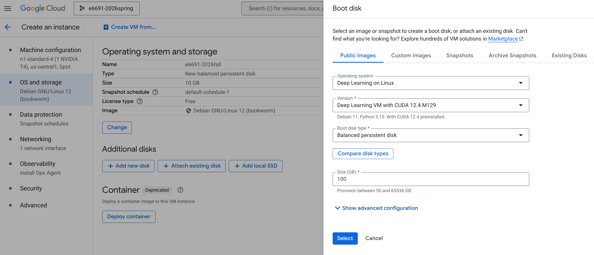
  Basic tools like CUDA/Python will be readily available for you.

  - You can further increase the disk space as necessary, but keep in mind that it will increase the cost of your machine. It is also possible to adjust the disk space at any point later by editing the machine.

  - On the right, go to the "Networking" section. Allow both HTTP and HTTPS traffic.
   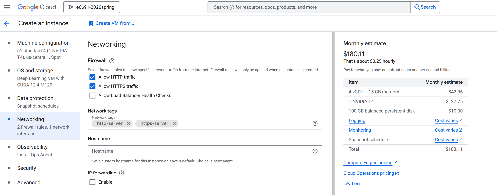

  - Click Create.

9.  Your machine should be available and running after a couple minutes. **Note that it is possible to get the "resource unavailable" error, which means that you will have to try after some time or in a different region.**
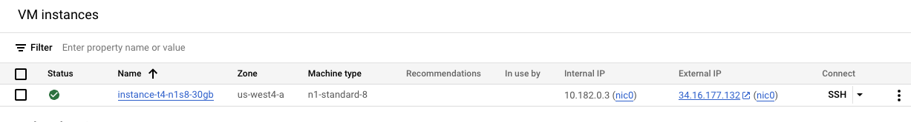
  - If you constantly runs into "resource unavailable" error, another option is to change the "Provisioning model" selection to "Spot" as shown below, as a **temporary alternative**.
  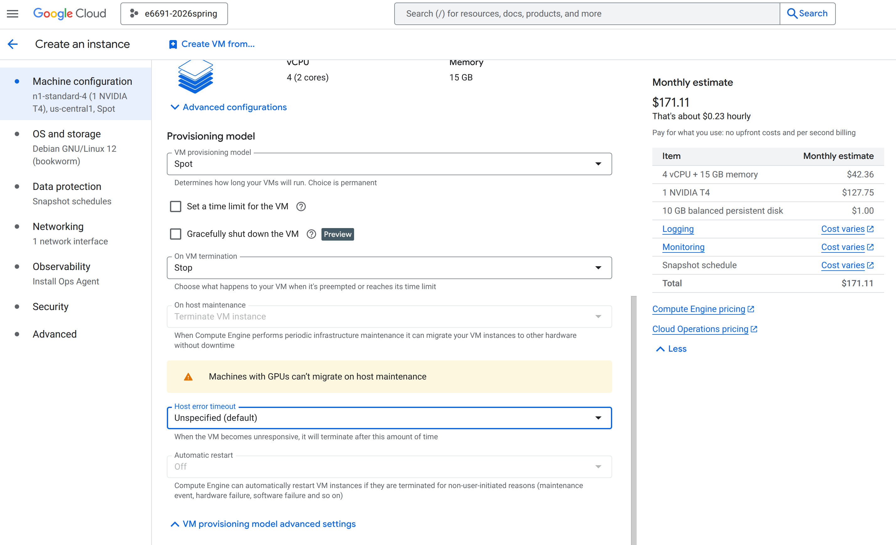
  **Note that this gives you only temporary access to the compute resource, which may be preemted at any time. It is thus important to sync your work to Github in a very timely manner. It is recommended to use the standard provisioning model whenever possible.**

10.  [**For Columbia LionMail Users** (*This is only applicable if you have mistakenly created the project using your Columbia account.*)]:  Columbia has restricted the exposure of external IP address and internet access from GCP within their organization. To setup internet access, please watch and follow the instructions in [this video](https://drive.google.com/file/d/1d07DYyiW0sSwjYeSyzm3vlB--RV7vm9w/view?usp=sharing3).

11. Connect to the VM Instance

  To connect to the VM instance we will use SSH. This is nearly identical to how we interface with the Jetson Nano, so by now it should be a natural transition.

  We're considering two options for SSHing into the instance: the [gcloud CLI](https://cloud.google.com/sdk/gcloud) and the browser based SSH window. We recommend the gcloud CLI method, but it requires some additional setup. However, using the browser based SSH window is just fine. To install gcloud, visit the page in the link and follow the setup instructions.

  To use the browser SSH window click "SSH" under the "Connect" tab of your instance. It will open a new browser window with an SSH connection established.
  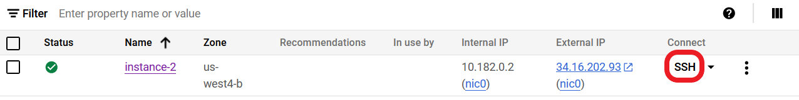
  After installing the gcloud CLI (optional), get the gcloud SSH command by clicking the dropdown arrow and clicking **"View gcloud command".**
  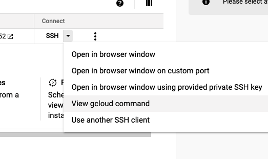

  Copy the SSH command to the clipboard and execute it in a local terminal.
  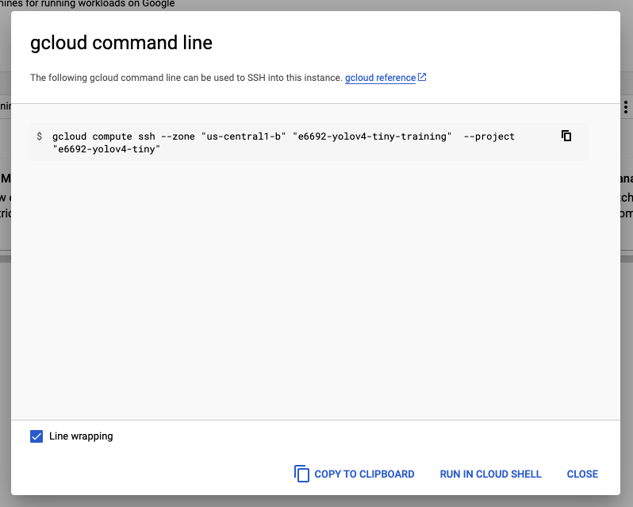

  Both connection methods will show this upon successful connection:
  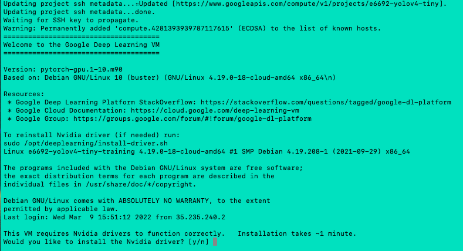

  Install the NVIDIA driver (y). If this fails, you may need to restart the VM and try again. When the driver is installed successfully, enter nvidia-smi. You will see an output summary of the GPU hardware/software.
  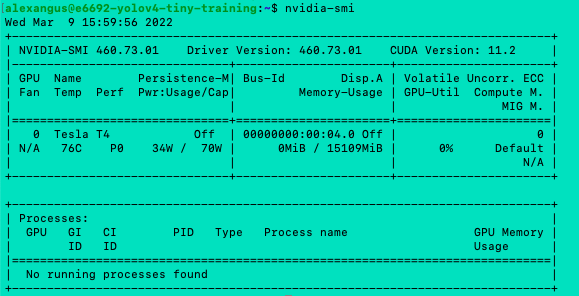

  You can also do an `import torch` in a Python shell to confirm that PyTorch is installed.
  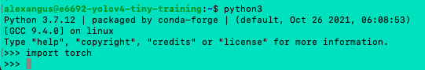

12. Connect to Jupyter Lab

  In order to access the JupyterLab server, we need to create a firewall rule to allow signals to reach the instance. In the GCP console select "VPC network" and "Firewall".
  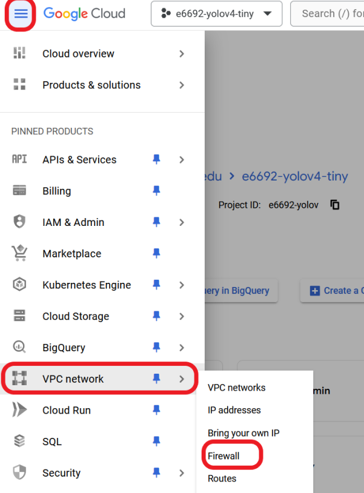

  Click "CREATE FIREWALL RULE"

  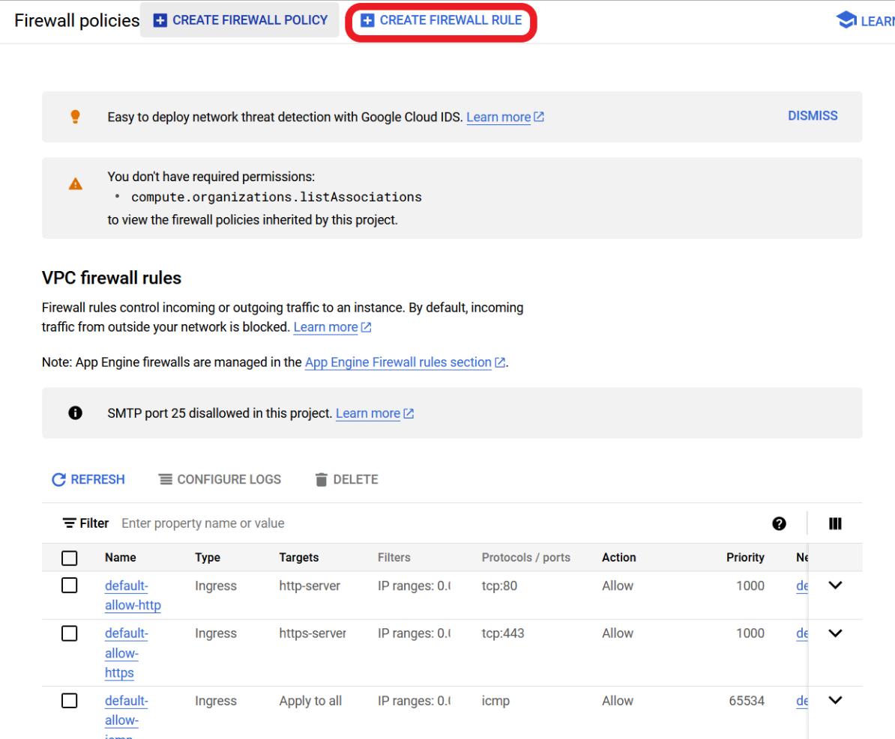

  Enter a name for the firewall rule.

  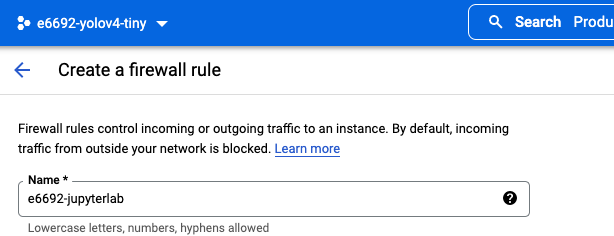

  Scroll down untill you see **"Targets"**. Select **"All instances in the network"**, and under **"Source filter"**, select **"IPv4 ranges"**, and enter **0.0.0.0/0** in the field below to allow all IP addresses (This is not secure, but we aren't dealing with anything sensitive).

  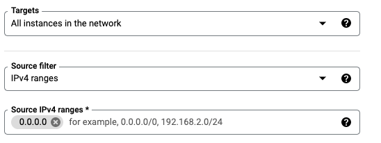

  Under **Protocols and ports click**, select **"Specified protocols and ports"** and select "TCP" and enter "8888". This allows us to access the JupyterLab server through port 8888.

  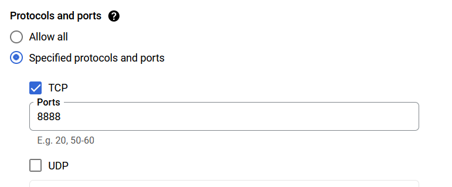

  Click **"CREATE"**.

  You may need to restart your instance to see the changes in the firewall rules.

  Back in the SSH terminal, enter `jupyter lab --allow-root --no-browser --ip 0.0.0.0 --port 8888`. You should see the JupyterLab server start.

  Now go back to the VM instances page of your project. You should see an IP address under **"External IP"**. This is the outward facing IP address of the VM instance, and we will use it to connect to the JupyterLab server. Copy the External IP and paste it into your browser with the port 8888 appended: `ip_address:8888`.

  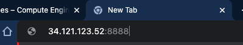

  You should see this page.

  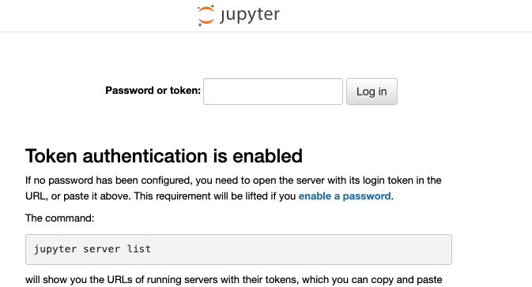

  Take the token string from the SSH terminal and paste it in as the password.

  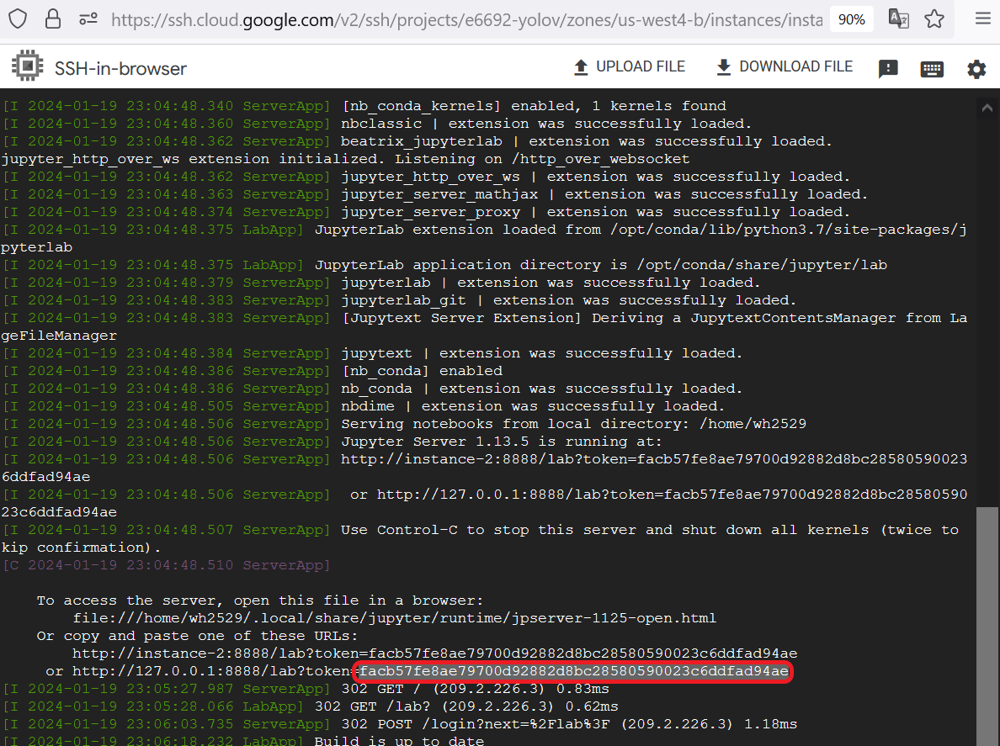

Once you see the JupyterLab interface, the setup is complete. You can now use JupyterLab exactly like you do on the Jetson Nano, but note that **we are not using a Docker container for the GCP portion of the lab.**

# NOTE: Make sure to shut down your GCP instances when you're not actively using them. Your credits will drain quickly.
